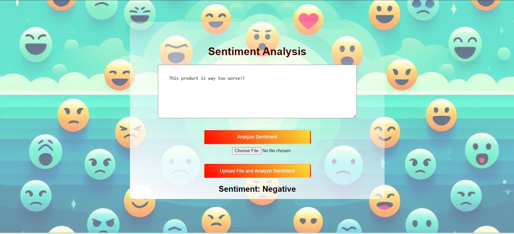

# 📊 Sentimental Analysis

This project is a sentiment analysis tool that processes text inputs and provides sentiment scores. It includes a frontend interface for users to input text and view results.

## ✨ Features

- 📝 Text input for sentiment analysis
- 📈 Displays sentiment score and analysis results
- 💻 User-friendly interface

## 🚀 Setup

1. Clone the repository:
    ```sh
    git clone https://github.com/aryasingh258/ML-Projects.git
    ```

2. Navigate to the project directory:
    ```sh
    cd ML-Projects/Sentimental-Analysis
    ```

3. Run the application:
    ```sh
    python app.py
    ```

## 🛠 Usage

- Open the application in your web browser.
- Enter text in the input box.
- Click the "Analyze Sentiment" button to see the sentiment score and analysis.

## 🖼 Frontend

Here is a screenshot of the frontend interface:



## 🤝 Contributing

Contributions are welcome! Please feel free to submit a pull request.
# ML-Projects
🚀 Machine Learning Projects Repository

A collection of machine learning projects showcasing various algorithms, techniques, and real-world applications. This repository includes:

📄 Code: Implementations of various machine learning algorithms and techniques.

📊 Datasets: A variety of datasets used in the projects to illustrate real-world applications.

📚 Documentation: Detailed explanations and guides for each project to help users understand and implement different ML concepts.


